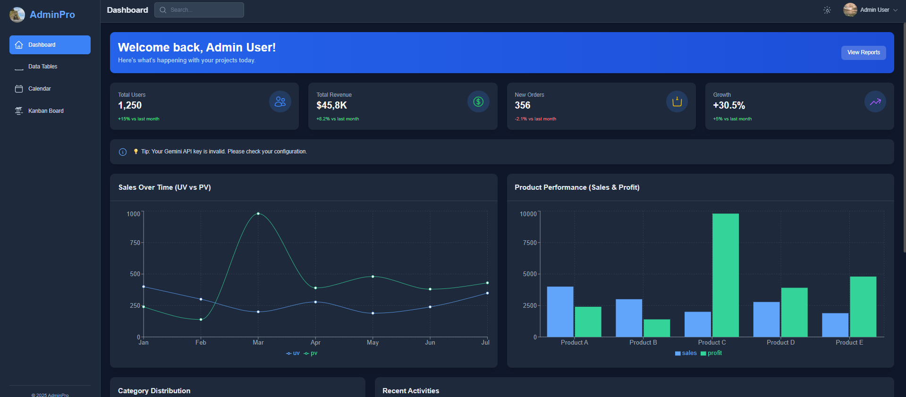
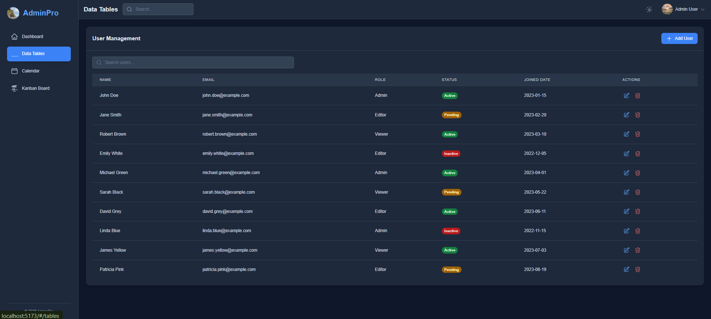
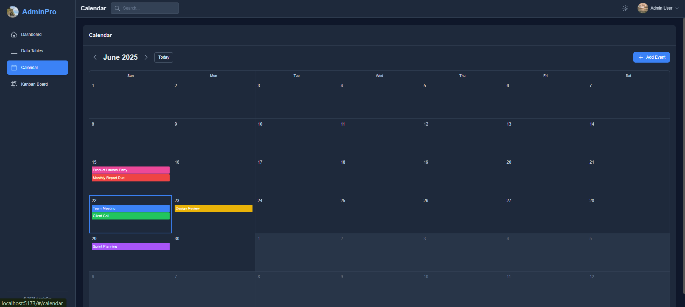
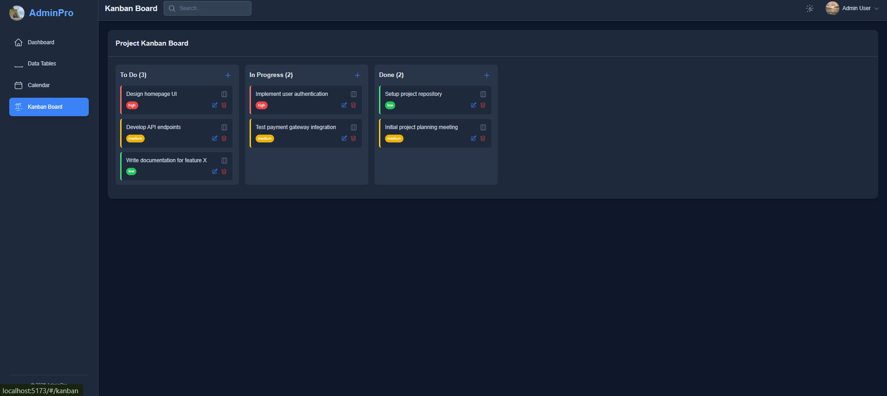

📊 React Dashboard Application
==============================

🚀 Project Overview
-------------------

This is a comprehensive web-based dashboard application built with **React**. It's designed to help individuals or small teams efficiently manage users, tasks, and events. The application features a responsive UI, intuitive navigation, and robust data persistence using Local Storage, ensuring that all your data remains available across browser sessions.

✨ Key Features
--------------

*   **Dashboard Overview**: Get a quick glance at key metrics, including:
    
    *   Total users.
        
    *   Total tasks, broken down by status: **New**, **Ongoing**, and **Completed**.
        
    *   Upcoming events at a glance.
        
*   **User Management**:
    
    *   Add new users with customizable names.
        
    *   View detailed user profiles displaying assigned tasks and their current statuses.
        
    *   Check, update, and delete tasks directly from a user's profile page.
        
    *   Delete users (this action also unassigns their tasks from the Kanban board).
        
*   **Kanban Board**: A highly visual and interactive task management system with three distinct columns:
    
    *   **To Do**
        
    *   **In Progress**
        
    *   **Done**
        
    *   Easily move tasks between columns using intuitive left/right arrows.
        
    *   Ability to assign tasks to any specific user.
        
    *   Option to delete tasks directly from the board.
        
*   **Calendar**: A full-featured calendar for event management:
    
    *   View events in **Month**, **Week**, or **Day** modes.
        
    *   Effortless navigation through dates (previous, next, today).
        
    *   Add new events for specific dates.
        
    *   Delete existing events.
        
*   **Charts & Analytics**: (Further details can be added here once implemented or if specific charts are defined.)
    
*   **Persistent Data**: All tasks and events are securely stored in your browser's Local Storage, ensuring your data persists even after you close and reopen the browser.
    
*   **Toast Notifications**: Provides real-time and non-intrusive feedback for various actions, such as adding/deleting tasks, moving tasks between Kanban columns, and more.
    

📸 Screenshots


Dashboard Overview
|  |
User Management
|  |
Calendar View
|  |
Kanban Board
|  | 


## 📁 Project Structure
|  | 
```bash
my-dashboard-app/
├── public/
│   ├── index.html          // The main HTML file where the React app is mounted.
│   └── favicon.ico         // Website icon displayed in the browser tab.
├── src/
│   ├── App.jsx             // The core application component, managing global state and data flow.
│   ├── index.js            // The entry point for the React application, responsible for rendering the App component.
│   ├── App.css             // Contains global CSS styles for the application.
│   ├── components/         // Directory for reusable UI components (e.g., UserCard, TaskItem, EventDisplay).
│   │   ├── DashboardSummary.jsx    // Component for displaying overall metrics.
│   │   ├── UserList.jsx            // Component for listing and managing users.
│   │   ├── UserProfile.jsx         // Component for detailed user profiles.
│   │   ├── KanbanBoard.jsx         // Component for the visual task management board.
│   │   ├── Calendar.jsx            // Component for the calendar view and event management.
│   │   ├── Charts.jsx              // Component(s) for rendering analytics charts.
│   │   └── Notifications.jsx       // Component for toast notifications.
│   ├── hooks/              // Directory for custom React hooks (e.g., useLocalStorage).
│   ├── utils/              // Utility functions (e.g., date formatting, data helpers).
│   ├── contexts/           // React Contexts for global state management (e.g., AuthContext, DataContext).
│   ├── assets/             // Static assets like images or icons.
│   ├── reportWebVitals.js  // Standard Create React App (CRA) file for measuring performance.
│   └── setupTests.js       // Standard CRA file for Jest/testing setup.
├── package.json            // Defines project metadata, essential scripts, and all required dependencies.
├── README.md               // This comprehensive README file providing project documentation.
└── .gitignore              // Specifies intentionally untracked files and directories to be ignored by Git.

```
⚙️ Getting Started
------------------

Follow these steps to set up and run a local copy of the project on your development machine.

### 🔧 Prerequisites

Ensure you have **Node.js** and either **npm** (Node Package Manager) or **Yarn** installed on your system.

*   **Node.js**: [Download](https://nodejs.org/) & [Install Node.js](https://nodejs.org/) (npm is included with Node.js installation).
    

### 📦 Installation

1.  git clone \[https://github.com/Garvit1904/Celebal\_Technologies\_Garvit/tree/bc47bb4a3b7425ccbea0a9e70bf23c227eed1046/Assignment3/react-admin-dashboard\](https://github.com/Garvit1904/Celebal\_Technologies\_Garvit/tree/bc47bb4a3b7425ccbea0a9e70bf23c227eed1046/Assignment3/react-admin-dashboard)_(Replace \[YOUR\_REPOSITORY\_URL\_HERE\] with the actual URL of your repository.)_
    
2.  Using **npm**:npm install
    

### 🚀 Running the Application

After successfully installing the dependencies, you can start the development server:

Using **npm**:

Plain textANTLR4BashCC#CSSCoffeeScriptCMakeDartDjangoDockerEJSErlangGitGoGraphQLGroovyHTMLJavaJavaScriptJSONJSXKotlinLaTeXLessLuaMakefileMarkdownMATLABMarkupObjective-CPerlPHPPowerShell.propertiesProtocol BuffersPythonRRubySass (Sass)Sass (Scss)SchemeSQLShellSwiftSVGTSXTypeScriptWebAssemblyYAMLXML`   npm start   `

This command will typically open the application in your default web browser at http://localhost:3000 (or another available port). The app will automatically reload in the browser whenever you make changes to the source code, facilitating rapid development.

🎯 Usage Instructions
---------------------

*   **Dashboard**: Upon launching the app, you'll see an overview of users, tasks, and upcoming events.
    
*   **User Management**: Navigate to the "Users" section to add new users, view their profiles, manage their tasks, and delete users.
    
*   **Kanban Board**: Access the "Kanban" section to visually manage tasks by dragging them between "To Do", "In Progress", and "Done" columns.
    
*   **Calendar**: Go to the "Calendar" section to add, view, and delete events, switching between month, week, and day views
