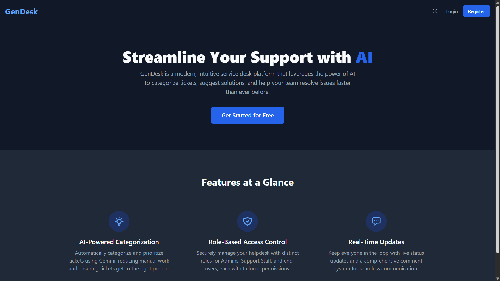
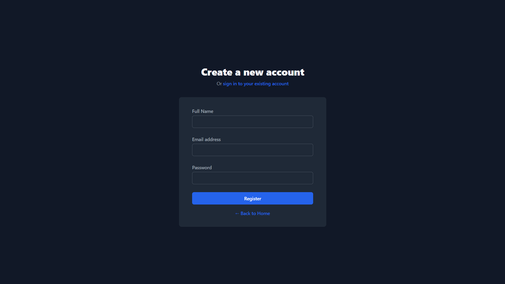
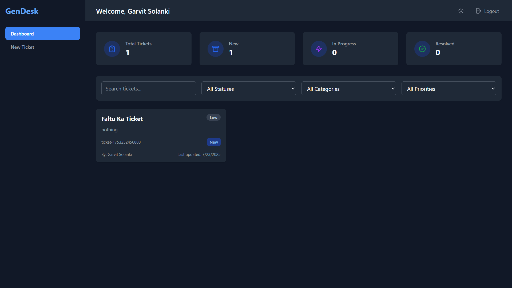
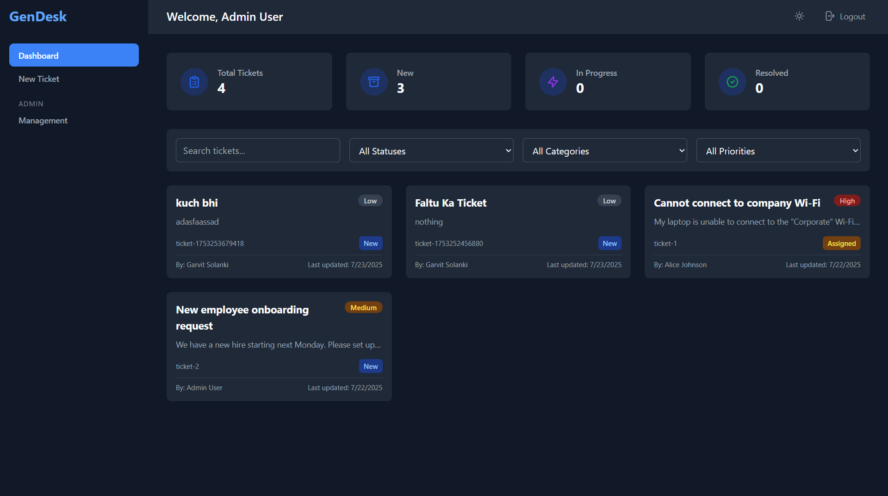

# Service Desk Application

 It is an advanced, AI-enhanced service desk application built with React. It leverages Firebase for real-time data persistence and user authentication, . The platform offers a streamlined, role-based workflow for users, support staff, and administrators in a modern, responsive interface with both light and dark modes.
---

## 🚀 Features

*   **Firebase Authentication**: Secure user registration and login.
*   **Firestore Database**: Real-time, persistent storage for all ticket and user data.
*   **Role-Based Access Control**: Different views and permissions for Admins, Support Staff, and Users.
*   **AI-Powered Assistance**:
    *   Automatic ticket categorization and prioritization using the Gemini API.
    *   AI-generated solution suggestions for support staff.
*   **Razorpay Payments**: Allows users to pay to boost their ticket's priority to "High".
*   **Responsive Design**: Works great on both desktop and mobile devices.
*   **Dark Mode**: For comfortable viewing in low-light environments.

---

## 📂 Folder Structure

The project follows a standard feature-sliced design pattern to keep the code organized, scalable, and easy to maintain.

```
📁 components/
    ├── AdminPage.tsx        → Admin interface (resolving tickets, managing users)
    ├── AuthPage.tsx         → Login/Register UI (already connected to Firebase)
    ├── Dashboard.tsx        → User/admin dashboard after login
    ├── HomePage.tsx         → Public landing/home page
    ├── Layout.tsx           → Reusable layout component (sidebar, header, etc.)
    └── TicketPage.tsx       → Ticket creation form (users raise issues)

📁 components/common/
    └── Spinner.tsx          → Reusable loading spinner component

📁 contexts/
    └── AppContext.tsx       → Global state (auth, tickets, theme) using React Context API

📁 services/
    ├── firebase.ts          → ✅ You’ll create this: Firebase Auth + Firestore setup
    ├── geminiService.ts     → (Optional AI-related logic, maybe Gemini/GPT API)
    └── mockApiService.ts    → Old mock data handlers (no longer needed after Firebase)

🗂️ Root Files:
├── .env.local               → Store your Firebase API keys (secured)
├── .gitignore               → Ignore sensitive/unnecessary files for Git
├── App.tsx                  → Root component; wraps the layout and routing
├── constants.ts             → App constants (e.g. roles, statuses, routes)
├── env.js                   → Optional env loader or runtime config
├── index.html               → HTML template for Vite
├── index.tsx                → App entry point (ReactDOM.render)
├── metadata.json            → Optional metadata/config info
├── package.json             → NPM dependencies and scripts
├── package-lock.json        → Dependency lock file
├── README.md                → Project overview/documentation
├── tailwind.config.js       → Tailwind CSS configuration
├── tsconfig.json            → TypeScript configuration
├── types.ts                 → Shared TypeScript types (User, Ticket, etc.)
└── vite.config.ts           → Vite bundler configuration


```
---

## ⚙️ Installation

1️⃣ **Clone the repository:**

```bash
git clone https://github.com/Garvit1904/Celebal_Technologies_Garvit.git
cd Service Desk Application
```

2️⃣ **Install dependencies**
```bash
npm install
```

3️⃣ **Setup your API key**
Create a .env file in the project root:

```bash
VITE_SHAZAM_CORE_RAPID_API_KEY=your_rapidapi_key_here
```

4️⃣ **Run the development server**
```bash
npm run dev
```

**Visit http://localhost:5173 to see the app running.**

## 📸 Screenshots






